# Pertemuan 6: Klasifikasi
[TKE1686] MK Machine Learning (3-SKS)

oleh: Gramandha Wega Intyanto, S.ST., M.T.

**Algoritma Klasifikasi yang akan di pelajari**
- _k-Nearest Neighbor_ (K-NN)
- _Decision Tree_

## _K-Nearest Neighbor_ (K-NN)
Metode k-Nearest Neighbor Classifier menentukan kelas/label dari suatu data uji
berdasarkan label dari data – data latih sekitarnya. Ilustrasi ditunjukkan pada Gambar berikut

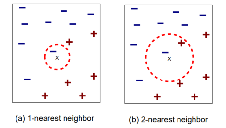

Algoritma untuk k-nearest neighbor sebagai beirkut :
1. Menentukan nilai k
2. Menghitung jarak antara data baru terhadap semua training data
3. Mengidentifikasi k nearest neighbor
4. Menentukan label/kelas data baru berdasarkan kelas k-nearest neighbor (dapat menggunakan voting)

Karakter dari algoritma k-nearest neighbor dapat dituliskan sebagai beirkut :
1. Cocok untuk data numerik
2. Mudah dipahami dan diimplementasikan
3. k-NN merupakan lazy learner (tidak membangun model secara eksplisit)
4. Penentuan label/kelas data baru membutuhkan computational cost yang
cukup tinggi
5. Perlu menentukan nilai k yang sesuai
a. Jika k terlalu kecil, sensitif terhadap noise
b. Jika k terlalu besar, nearest neigbor mungkin mencakup data dari
kelas lain

### Video KNN Penejelasan K-NN
[](https://www.youtube.com/watch?v=0p0o5cmgLdE)         

### Contoh Studi kasus

Studi kasus di bawah ini menggunakan penetuan nilai k=4 untuk mencari x1 = 3 dan x2 = 7 termasuk dalam kelas mana (_GOOD_ atau _BAD_)

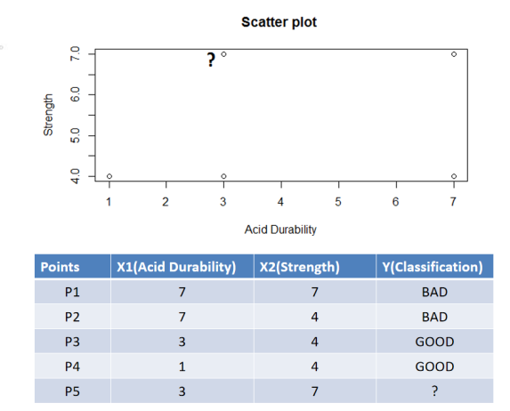

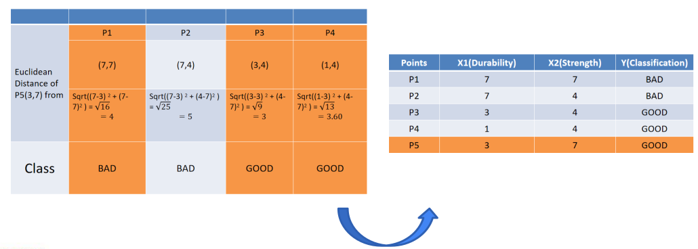

### Contoh Program

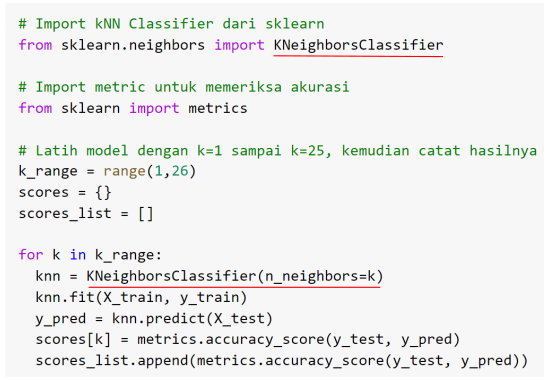

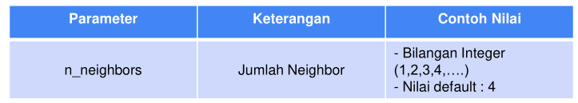

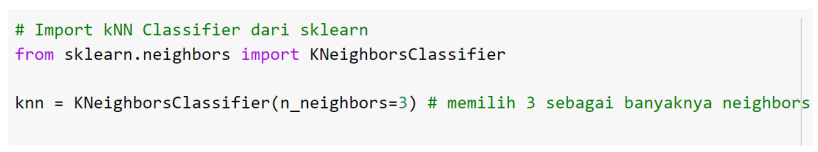

## _Decision Tree_

Decision Tree (Pohon Keputusan) merupakan salah satu algoritma pembelajaran
mesin yang mengklasifikasi dengan mengambil suatu keputusan antara benar atau
tidaknya suatu aturan. Kelebihan dari algoritma Decision Tree adalah input yang
digunakan boleh berupa tipe data apapun (String, Integer, Float, Boolean, dll),

Video _Decision Tree_
[](https://www.youtube.com/watch?v=JcI5E2Ng6r4)


### Contoh studi kasus

Bagian paling puncak dari pohon keputusan (Hari Libur?) disebut dengan root node. Bagian
selanjutnya dari pohon keputusan adalah branch, pada gambar di atas digambarkan oleh
node (Jam > 17.00?). Terakhir leaves merupakan node yang berisi kelas dari permasalahan
yang ingin diklasifikasikan.
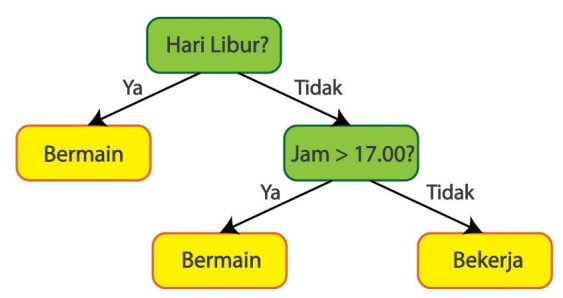

Salah satu cara membangun Decision Tree adalah dengan menggunakan perhitungan Gini Impurity. Gini Impurity untuk leaf dari Decision Tree dapat dihitung menggunakan persamaan berikut:
$
𝐺𝑖𝑛𝑖 𝐼𝑚𝑝𝑢𝑟𝑖𝑡𝑦 = 1 − (𝑃𝑟𝑜𝑏𝑎𝑏𝑖𝑙𝑖𝑡𝑎𝑠(𝑌𝑎))^2 − (𝑃𝑟𝑜𝑏𝑎𝑏𝑖𝑙𝑖𝑡𝑎𝑠(𝑇𝑖𝑑𝑎𝑘))^2 
$

Untuk menentukan root, perlu dicari Gini Impurity terkecil dari “Kebutuhan Primer”, “Sudah Gajian”, dan “Harga Barang” terhadap “Beli”. Gini Impurity “Kebutuhan Primer” terhadap “Beli” dapat diilustrasikan pada Gambar berikut

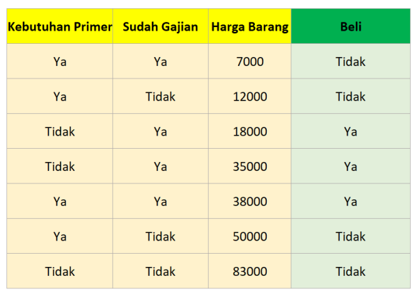

Total Gini Impurity dapat dihitung dengan weighted average dari Gini Impurity kedua
leaves. Jumlah kemunculan “Ya” untuk kebutuhan primer sebanyak 4 dan jumlah
kemunculan “Tidak” untuk kebutuhan primer sebanyak 3, maka weighted average Gini
Impurity dapat dihitung dengan (terdapat di gambar): 
$ Gini Impurity leaf kiri * 4 / (4+3) + Gini Impurity leaf kanan * 3 / (4+3)$ 

Dengan cara yang sama, Gini Impurity “Sudah Gajian” terhadap “Beli” dihitung dan diilustrasikan pada Gambar berikut:

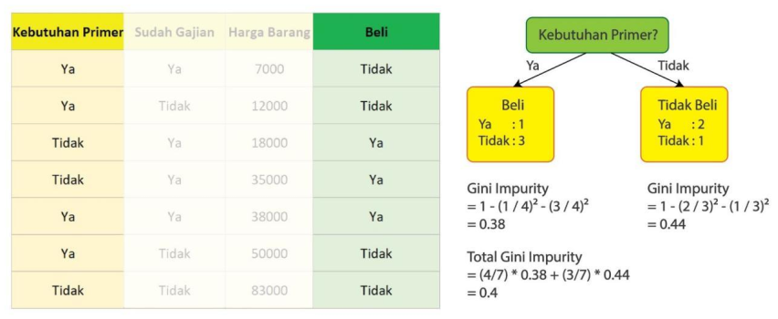

Karena “Harga Barang” memiliki variabel kontinu, Gini Impurity “Harga Barang” terhadap
“Beli” dihitung dengan cara yang sedikit berbeda. Pertama, data harus diurutkan
berdasarkan “Harga Barang” terkecil ke “Harga Barang” terbesar. Kemudian untuk setiap
data yang berdekatan, hitung Gini Impurity untuk rata-rata “Harga Barang” kedua data yang
berdekatan. Pada Gambar 20, dihitung Gini Impurity untuk “Harga Barang” > 9500.

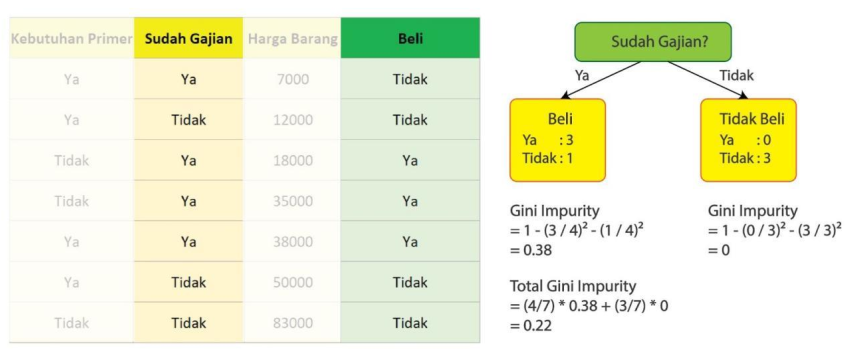

Dengan cara yang sama, hitung Gini Impurity untuk 15000, 26500, 36500, 44000, dan 66500. Setelah itu ambil Gini Impurity terkecil sebagai kandidat root. Jika ada lebih dari 1 yang sama, maka bebas menentukan yang mana yang ingin digunakan sebagai root.

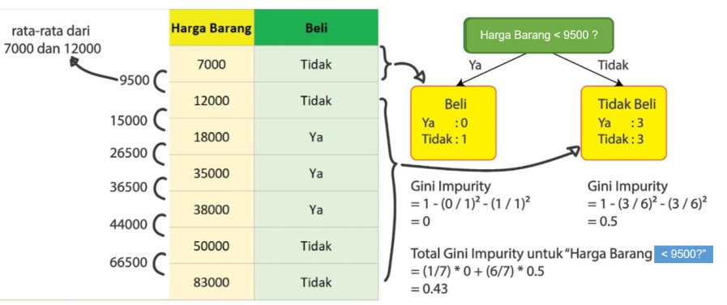

Setelah proses diatas, didapatkan Gini Impurity dari “Kebutuhan Primer”, “Sudah Gajian”, dan “Harga Barang” terhadap “Beli” secara berurutan 0.4, 0.22, dan 0.34. Karena Gini Impurity “Sudah Gajian” terhadap ”Beli” merupakan yang terkecil (0.22), maka “Sudah Gajian” dijadikan root dari Decision Tree. Maka Decision Tree sementara menjadi seperti
pada Gambar berikut

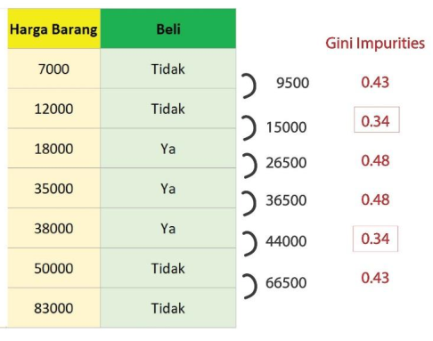

Karena Gini Impurity leaf kanan adalah 0, maka tidak perlu di-split lagi. Oleh karena itu
hanya leaf kiri yang perlu di-split. Leaf kiri dapat di-split dengan mencari Gini Impurity
terkecil dari “Kebutuhan Primer” atau “Harga Barang”. Cara yang dilakukan sama, namun
data yang digunakan lebih sedikit karena telah tersaring oleh Decision root. Contoh untuk
“Kebutuhan Primer” dan “Harga Barang” tersaji pada Gambar berikut ini
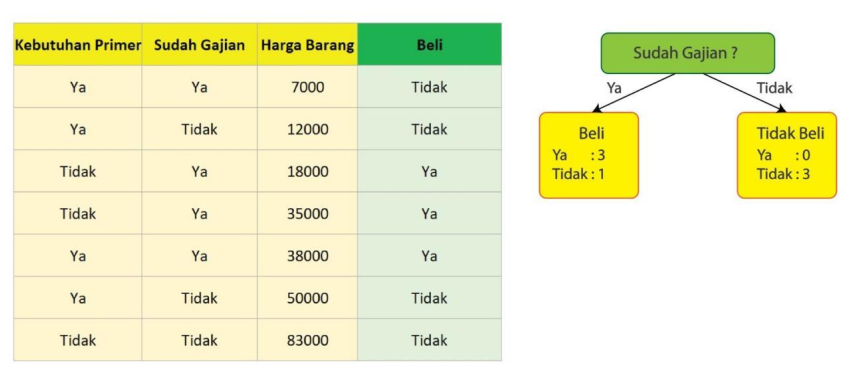
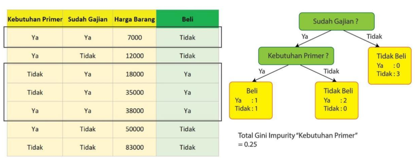
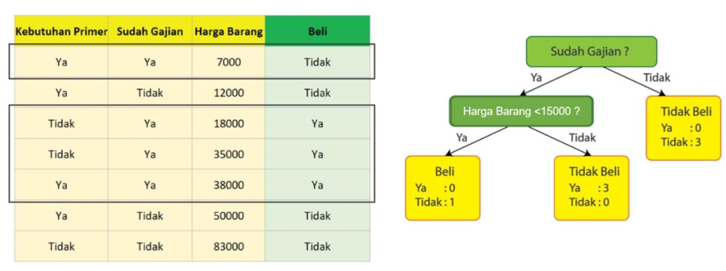

untuk data kontinu, perlu dihitung Gini Impurity dari data berdekatan. Karena Gini Impurity dari “Harga Barang > 15000” lebih kecil dibandingkan dengan Gini Impurity “Kebutuhan Primer”, maka “Harga Barang > 15000” dipilih sebagai branch. Tidak diperlukan proses split lagi karena Gini Impurity dari seluruh leaves sudah mencapai 0. Sehingga Decision Tree yang dihasilkan adalah seperti pada Gambar

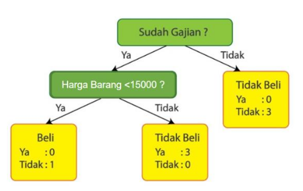

### Contoh Program

Pada bahasa pemrograman Python, Decision Tree dapat dilakukan dengan menggunakan
pustaka Scikit-Learn dengan menjalankan potongan kode

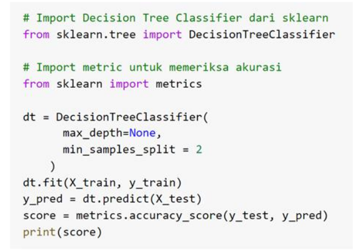

Beberapa parameter dapat diubah nilainya, antara lain adalah parameter max_depth dan
min_samples_split, dengan penjelasan pada tabel dan gambar berikut

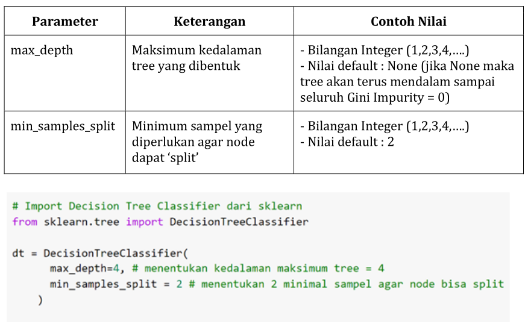

## LKM 4

### **Soal Klasterisasi dengan k-NN dan Hierarchical Clustering**

#### **Deskripsi Soal**
Sebuah perusahaan ingin mengelompokkan pelanggan berdasarkan pola pembelian mereka.  
Data yang tersedia mencakup informasi **penghasilan bulanan (dalam juta rupiah)** dan **jumlah transaksi dalam sebulan**.  
Gunakan **k-NN** dan **Hierarchical Clustering** untuk mengelompokkan pelanggan dan tentukan pola yang terbentuk.  

#### **Data Pelanggan**

| ID Pelanggan | Penghasilan (Juta Rupiah) | Jumlah Transaksi per Bulan |
|-------------|---------------------------|----------------------------|
| P1          | 3.5                       | 5                          |
| P2          | 7.0                       | 20                         |
| P3          | 2.0                       | 3                          |
| P4          | 5.5                       | 10                         |
| P5          | 8.0                       | 25                         |
| P6          | 1.5                       | 2                          |
| P7          | 6.0                       | 12                         |
| P8          | 9.5                       | 30                         |
| P9          | 4.0                       | 7                          |
| P10         | 3.0                       | 4                          |

---

#### **Tugas**
##### **1. K-NN Clustering**
- Jika kita sudah memiliki klaster awal dengan pusat klaster sebagai berikut:
  - **Klaster 1**: (2.5, 4)
  - **Klaster 2**: (7.5, 22)
- Gunakan metode **k-NN** untuk mengelompokkan pelanggan ke dalam salah satu dari klaster tersebut berdasarkan jarak Euclidean.
- Tentukan klaster akhir setelah semua pelanggan dikategorikan.

##### **2. Hierarchical Clustering**
- Gunakan metode **Agglomerative Hierarchical Clustering** dengan pendekatan **Single Linkage** atau **Complete Linkage**.
- Buat **dendrogram** untuk menunjukkan proses penggabungan klaster hingga terbentuk satu klaster besar.
- Tentukan **jumlah klaster optimal** berdasarkan dendrogram.

### **Soal Klasifikasi dengan k-NN dan Decision Tree**

### **Deskripsi Soal**
Sebuah bank ingin mengklasifikasikan calon nasabah ke dalam kategori **"Layak Kredit"** atau **"Tidak Layak Kredit"** berdasarkan beberapa parameter.  
Data yang tersedia mencakup **penghasilan bulanan**, **jumlah pinjaman yang sedang berjalan**, dan **status pekerjaan**.  
Gunakan **k-NN** dan **Decision Tree** untuk melakukan klasifikasi dan tentukan pola yang terbentuk.

---

### **Data Nasabah**

| ID Nasabah | Penghasilan (Juta Rupiah) | Pinjaman Aktif (Juta) | Status Pekerjaan  | Status Kredit (Label) |
|-----------|---------------------------|----------------------|------------------|----------------------|
| N1        | 5.0                       | 10                   | Tetap            | Layak Kredit        |
| N2        | 2.5                       | 5                    | Kontrak          | Tidak Layak Kredit  |
| N3        | 7.0                       | 20                   | Tetap            | Layak Kredit        |
| N4        | 3.0                       | 8                    | Kontrak          | Tidak Layak Kredit  |
| N5        | 6.0                       | 15                   | Tetap            | Layak Kredit        |
| N6        | 4.0                       | 12                   | Kontrak          | Tidak Layak Kredit  |
| N7        | 8.5                       | 25                   | Tetap            | Layak Kredit        |
| N8        | 3.5                       | 6                    | Kontrak          | Tidak Layak Kredit  |
| N9        | 6.5                       | 18                   | Tetap            | Layak Kredit        |
| N10       | 2.0                       | 4                    | Kontrak          | Tidak Layak Kredit  |

---

### **Tugas**
#### **1. K-NN Classification**
- Gunakan metode **k-Nearest Neighbors (k-NN)** untuk mengklasifikasikan nasabah baru dengan fitur berikut:
  - **Penghasilan** = 4.5 juta rupiah  
  - **Pinjaman Aktif** = 9 juta rupiah  
  - **Status Pekerjaan** = Kontrak  
- Gunakan **k = 3** dan hitung **jarak Euclidean** untuk menentukan kelas nasabah tersebut.

#### **2. Decision Tree Classification**
- Gunakan metode **Decision Tree** untuk membangun model klasifikasi berdasarkan fitur yang tersedia.
- Gambarkan struktur **decision tree** yang terbentuk.
- Gunakan model untuk memprediksi status kredit nasabah dengan parameter berikut:
  - **Penghasilan** = 6.0 juta rupiah  
  - **Pinjaman Aktif** = 14 juta rupiah  
  - **Status Pekerjaan** = Tetap  


```python

```
